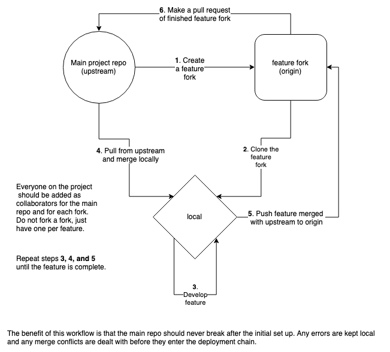

## Standups

- Day four
 - Devise: recommended password encryption method
 - Sign in branch merged with master
 - Posts will include user id
 -

## Sprints

*First Sprint*
Day one:
* Familiarise ourselves with Rails
* Set up CICD  (travis, heroic)
* Set up code quality checkers (rubocop, simplecov)
* Set up documentation
* Set up reminders on slack

Day two:
* Create user stories from spec
* Mockups of site
* Prioritise feature development
* Setup naming conventions
* Develop features

---

## Retros

Day four

- Lisa/ Yemi (afternoon)/ Frankie/ Nicholas (morning)
- - Getting in earlier (9:30) was good, helped us be more productive in the morning
 - Following the intro to rails tutorial was extremely helpful
 - Testing the model in rails also very beneficial
 - Created an infinite loop, able to fix! Nice!
 - When a user signs up they are redirected to the sign up/ in page
 - Stores user information in the users table
- Yemi (morning)/ Michael/ Nicholas (afternoon)/ Laurence
 - Edit and delete posts
 - Edit redirects to posts/id/edit
 - Redirects back to posts page after either action
- Tomorrow
 - Change the root to the sign in page? (Ask client)
 - Travis is not deploying to heroku
 - Merge sign up with master
 - Finish the sign in page
 - Improvements to process
 - Code review - add comments on pull requests so we are able to bring them up/ discuss in retros + have documentation of our learning


### Integration method

Instead of a standard clone from and push straight to master, we implemented a different method:



### Setting up local databases


*Development Environment*

We must manually create the local database for ActiveRecord:
```
CREATE DATABASE pgapp_development;
```
We must run the migrations to set up what we want:
```
bin/rails db:migrate RAILS_ENV=development
```
To serve the app:
```
rackup
```
Visit the local server:
```
http://localhost:9292
```
The page showed a confirmation that rails is working, not the app, so:
```
rake routes
```
which returned:
```
Makerss-MacBook-Pro:acebook-Spacebook student$ rake routes
   Prefix Verb   URI Pattern               Controller#Action
    posts GET    /posts(.:format)          posts#index
          POST   /posts(.:format)          posts#create
 new_post GET    /posts/new(.:format)      posts#new
edit_post GET    /posts/:id/edit(.:format) posts#edit
     post GET    /posts/:id(.:format)      posts#show
          PATCH  /posts/:id(.:format)      posts#update
          PUT    /posts/:id(.:format)      posts#update
          DELETE /posts/:id(.:format)      posts#destroy
```
which told us we need to visit:
```
http://localhost:9292/posts
```

*Test Environment*

Running rspec told us we need another database:
```
CREATE DATABASE pgapp_test;
```
This was enough, we didn't need to run migrations again because it's done while testing.

After looking into the Rake commands, we are also able to setup the database automatically by running:
```
rake -T
rake db:setup
```

*Populate the database*

In db/seeds.rb populate the database with *Post.create('message')*

e.g.,

```
i = 0

while i < 10 do
 Post.create(message: "Hello, world!")
 Post.create(message: "I'm next")
 i +=1
end
```

then run
```
rake db:seed
```

### Deploying to Heroku

Heroku is a hosting platform for the app to be publicly available.

- Create a Heroku account
- Make a new app project
- In Heroku (settings/config vars) we set the environment variables referencing the database.
- In the database.yml file we referenced the environment variables.
- In the deployment tab, connect to the github repo and set to automatically deploy.  
- We manually added the database in the Heroku console - (rake db:migrate) but can this
be added to the Procfile?
- Create a Procfile in the root directory and add `web: bundle exec rackup  -p $PORT` - This
gives an instruction to Heroku to run the app with a dynamically set port.  
- Visit https://acebook-spacebook.herokuapp.com/
=======


### Co authoring commits so everyone gets credit for everything they work on

Add two empty lines in the commit message and then add the relevant tags:
```
Co-authored-by: LisaMcCormack <lisamccormack85@gmail.com>
Co-authored-by: fetc90 <francescachater@gmail.com>
Co-authored-by: LaurenceTaylor <ltaylorapp@gmail.com>
Co-authored-by: yem82 <yemiadebayo60@gmail.com>
Co-authored-by: hughbric <mhughes36@live.co.uk>
Co-authored-by: n3ttl3t <n3ttlt@gmail.com>
```
